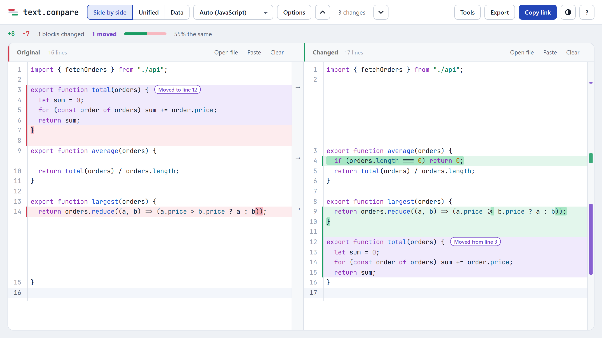
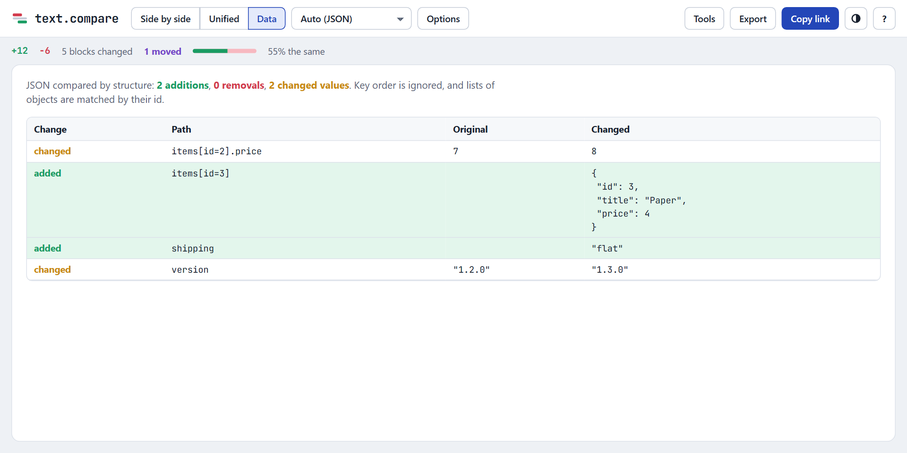
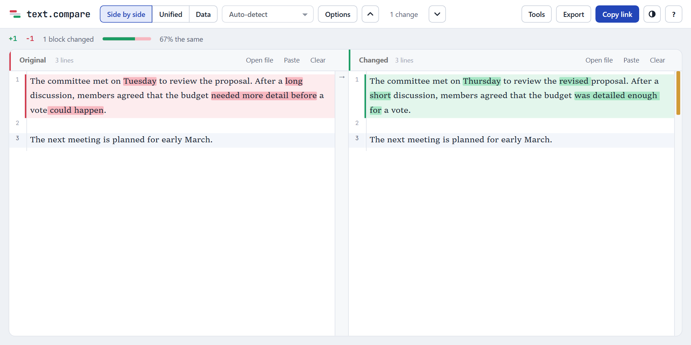
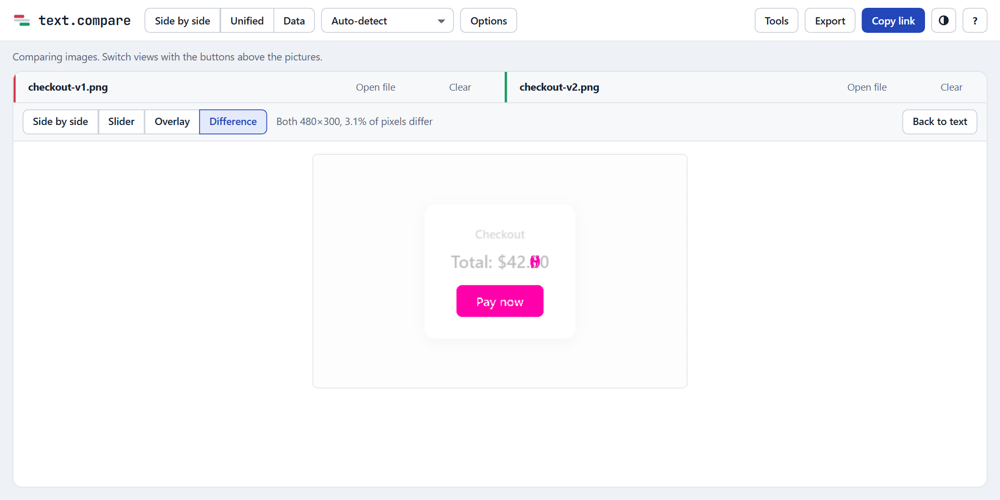
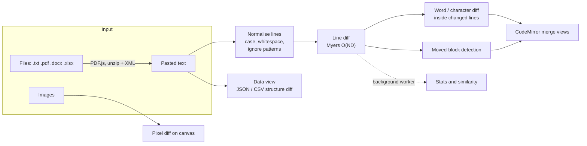
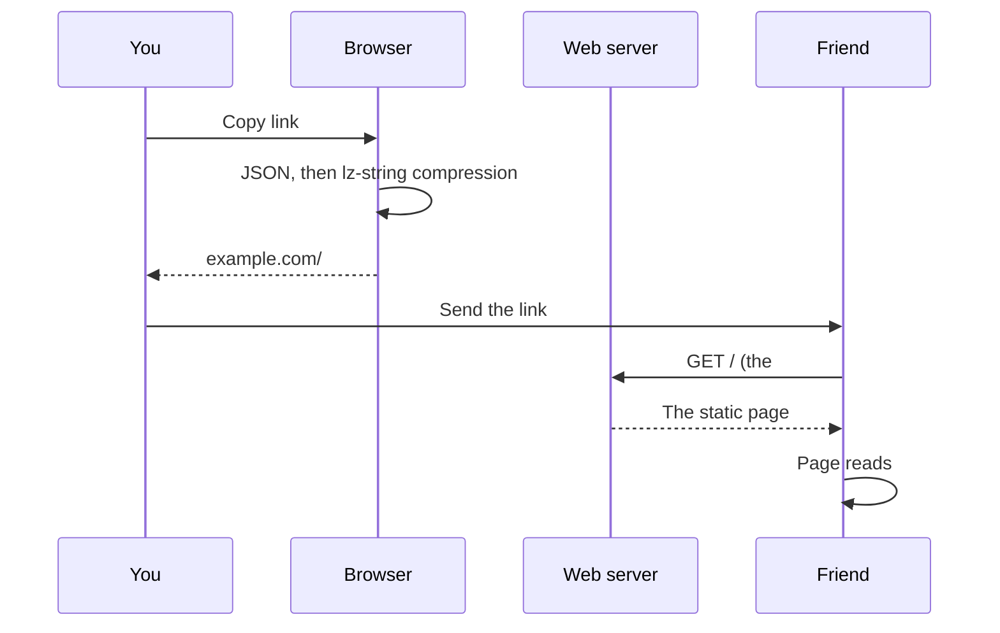

<div align="center">


# text.compare lite

### The simplest way to run your own private diff tool.

Text, code, JSON, CSV, Word, Excel, PDF and images, compared entirely in your browser.<br />
No backend, no database, no accounts, no API keys. Clone it, run it, done.

[**Try it live**](https://text.compare) &nbsp;·&nbsp;
[Choose a version](#choose-your-version) &nbsp;·&nbsp;
[Quick start](#quick-start) &nbsp;·&nbsp;
[Features](#features) &nbsp;·&nbsp;
[Self-host](#host-your-own-copy) &nbsp;·&nbsp;
[How it works](#how-it-works)

[](https://github.com/JamesClayPatton/text-compare-lite/actions/workflows/ci.yml)
[](LICENSE)


[](https://buymeacoffee.com/Clayberd)

</div>

<picture>
  <source media="(prefers-color-scheme: dark)" srcset="docs/hero-dark.png" />
  
</picture>

## Choose your version

<table>
<tr>
<th width="50%">text.compare full</th>
<th width="50%">text.compare lite<br /><sub>you are here</sub></th>
</tr>
<tr>
<td valign="top">

**Everything behind [text.compare](https://text.compare).** The same tool, plus optional extras.

- Every diff feature
- Optional sign-in (Google or email link) with **end-to-end encrypted** cloud saves via Supabase
- Admin panel with anonymous usage counts
- Optional Google Analytics

**Best for:** running your own public site with accounts.

<a href="https://github.com/JamesClayPatton/text-compare"></a>

</td>
<td valign="top">

**The simplest way to self-host.** Static files only, no backend code, nothing to configure.

- Every diff feature
- Library and history in your browser
- No outside services at all
- Smallest codebase to read and trust

**Best for:** your laptop, a company network, or free static hosting.

<a href="#quick-start"></a>

</td>
</tr>
</table>

Both are open source under the same license, and both run with no setup. The full version just has
more code, because its extras are there even when switched off.

## Quick start

You need [Node.js](https://nodejs.org) 22.12 or newer (24 LTS recommended). That's the only requirement.

```sh
git clone https://github.com/JamesClayPatton/text-compare-lite.git
cd text-compare-lite
npm install
npm run dev
```

Open http://localhost:5173 and start comparing. There is nothing to configure and no `.env` file to fill in.

**Prefer Docker?** No Node needed:

```sh
git clone https://github.com/JamesClayPatton/text-compare-lite.git && cd text-compare-lite
docker build -t text-compare-lite . && docker run -d -p 8080:80 text-compare-lite
```

**Want it online?** Deploy a free copy in one click:

[](https://app.netlify.com/start/deploy?repository=https://github.com/JamesClayPatton/text-compare-lite)
&nbsp;
[](https://vercel.com/new/clone?repository-url=https://github.com/JamesClayPatton/text-compare-lite)

## Why this exists

Comparing two pieces of text is a simple job, but most free diff sites wrap it in banner ads, cookie
walls and upsells, and many quietly upload whatever you paste to their servers. That's a bad deal
when the text is a contract, a config file full of secrets, or your own writing.

This is the diff tool I wanted instead:

- **Private by design.** Comparing happens in your browser tab. Your text is never uploaded, and the code is small enough to check that yourself.
- **Fast.** A Myers diff on integers, with the heavy stats in a background worker. An 8 MB log against an edited copy takes about two seconds.
- **Good at the hard cases.** Moved code, reformatted JSON, reordered CSV rows, PDFs, Word files and screenshots.
- **Easy to host.** `npm run build` gives you a folder of static files that runs anywhere.

## Features

### See what changed, precisely

- **Side by side or unified**, with changed words or single characters highlighted inside each line
- **Moved blocks** shown in violet with a tag like *Moved to line 12* that jumps to the other copy, instead of a big deletion plus a big addition
- **Syntax highlighting** for 100+ languages, picked from the file name or the text itself
- **Change map** beside the editor, <kbd>F7</kbd> / <kbd>Shift</kbd>+<kbd>F7</kbd> to step through changes, and an option to hide unchanged lines
- **Merge as you go**: both sides are editable, with undo, find and replace, and arrows that copy a block across

### Decide what counts as a change

- Ignore **upper/lower case**, **spaces at line ends**, **all whitespace** or **blank lines**
- Ignore anything matching a **pattern**: ready-made ones for dates and times, GUIDs, hex values and numbers, or your own regular expressions (made for comparing log files)

### Beyond plain text

| | |
|---|---|
| **Data view** compares JSON by structure (key order ignored, arrays of objects matched by `id`) and CSV/TSV/Excel by rows and columns, with rows matched on a key column. |  |
| **Document mode** for prose: wrapped paragraphs in a readable serif, changes shown word by word. Opens **PDF** and **Word (.docx)** files directly. |  |
| **Image compare** side by side, with a slider, as an overlay, or as a pixel-difference map that reports how much of the image changed. |  |

### Keep it, share it, export it

- **Library** of saved comparisons and a **history** of recent ones, searchable, kept in your browser
- **Copy link** puts the whole comparison inside the link itself. Nothing is stored anywhere
- **Report**: a self-contained HTML redline to send to someone, or print it straight to PDF
- **`.patch`** download in standard unified format (works with `git apply`), or copy the diff
- **Tools** to format JSON with sorted keys, sort lines, strip trailing spaces and swap sides
- Light and dark themes, a phone layout, and **works offline** once installed as an app

### Keyboard shortcuts

| Keys | Action |
|---|---|
| <kbd>F7</kbd> or <kbd>Alt</kbd>+<kbd>↓</kbd> | Next change |
| <kbd>Shift</kbd>+<kbd>F7</kbd> or <kbd>Alt</kbd>+<kbd>↑</kbd> | Previous change |
| <kbd>Ctrl</kbd>+<kbd>F</kbd> | Find and replace in a side |
| <kbd>Ctrl</kbd>+<kbd>Z</kbd> | Undo an edit or merge |
| <kbd>Ctrl</kbd>+<kbd>S</kbd> | Save the comparison to your library |
| <kbd>?</kbd> | Show help |

### Ready-made landing pages

The build creates a page for each common job, each starting the tool in the right mode, with its own
title, description and FAQ for search engines: `/json-compare/`, `/pdf-compare/`, `/word-compare/`,
`/excel-compare/`, `/image-compare/` and `/code-compare/`. Add your own in [`site/pages.ts`](site/pages.ts).

## Privacy

| | Where it goes |
|---|---|
| Text you paste or type | Compared in your browser tab. It never leaves the browser |
| Files you open (PDF, Word, Excel, images) | Read in your browser; never uploaded |
| Share links | The text rides in the part after `#`, which browsers never send to a server |
| Library and history | Kept in this browser only (IndexedDB). History can be turned off in Options |
| Analytics, cookies, tracking | None |

The included [`nginx.conf`](nginx.conf) sets a Content Security Policy that blocks every outside
script and connection, and a browser test fails if the page ever contacts another site.

## How it works

text.compare lite is a static site: HTML, CSS and TypeScript built with [Vite](https://vite.dev).
All the comparing happens in the browser, and there is no server code at all.



<details>
<summary><b>The diff engine</b></summary>

Lines are compared with Myers' O(ND) algorithm in its linear-space form (middle-snake bisection),
after trimming the common start and end. Each distinct line is mapped to an integer first, so the
algorithm compares numbers, not strings. A time budget makes pathological inputs fall back to a
coarser result instead of freezing the page; an 8 MB log compared against an edited copy finishes
in about two seconds.

Inside each changed block a second pass diffs *tokens*: whole words in word mode, or code points
in character mode (so emoji are never split). Those ranges become the highlighted spans.

Source: [`src/seq-diff.ts`](src/seq-diff.ts), [`src/diff-core.ts`](src/diff-core.ts), [`src/worddiff.ts`](src/worddiff.ts)
</details>

<details>
<summary><b>What counts as a change</b></summary>

Every option works by normalising a *copy* of each line before comparing: patterns are replaced
with a placeholder, then whitespace is trimmed or removed, then case is folded. Lines that match
after normalising count as equal, but the editor still shows your original text. Blank lines can be
skipped entirely, so extra spacing never shows as a change.

The same normalised diff drives the editor highlighting through a custom diff function handed to
CodeMirror, so what you see and what's counted always agree.

Source: [`src/normalize.ts`](src/normalize.ts), [`src/merge-override.ts`](src/merge-override.ts)
</details>

<details>
<summary><b>Moved blocks</b></summary>

After the diff, removed runs of lines are looked up among inserted lines. A run that reappears
elsewhere (two or more non-blank lines, or one line of 30+ characters) is a move. Moves are found
from the editor's own change blocks, so the violet highlight always lines up with the red and
green around it.

Source: [`src/moves.ts`](src/moves.ts), [`src/moved-deco.ts`](src/moved-deco.ts)
</details>

<details>
<summary><b>Data view</b></summary>

**JSON** is parsed and walked as a tree. Object keys are compared as sets, so key order never
matters. Arrays whose items all carry a unique `id`, `key`, `_id`, `uuid`, `code` or `name` are
matched by that field; other arrays are compared by position. Each difference is listed by its path,
such as `items[id=3].price`.

**CSV/TSV** is parsed with full quoting support after detecting the delimiter. Columns are matched
by header name. Rows are matched by the first column when its values are unique on both sides,
and otherwise by a diff of the rows in order.

Source: [`src/structure.ts`](src/structure.ts)
</details>

<details>
<summary><b>Files</b></summary>

- **PDF**: text is extracted page by page with [PDF.js](https://mozilla.github.io/pdf.js/), loaded only when you open a PDF
- **Word (.docx)** and **Excel (.xlsx)** are zip files of XML: they're unzipped with [fflate](https://github.com/101arrowz/fflate) and read directly, one line per paragraph or one CSV row per spreadsheet row
- **Text** is decoded as UTF-8, UTF-16 (by byte-order mark) or Windows-1252, and binary files are refused
- **Images** are drawn to a canvas and compared pixel by pixel

Source: [`src/documents.ts`](src/documents.ts), [`src/office.ts`](src/office.ts), [`src/pdf.ts`](src/pdf.ts), [`src/pixeldiff.ts`](src/pixeldiff.ts)
</details>

<details>
<summary><b>Share links</b></summary>



The text is compressed with [lz-string](https://github.com/pieroxy/lz-string) into the URL fragment.
A tiny script at the top of the page removes the fragment from the address bar before any other
script runs, so it can't leak into browser history tools.

Source: [`src/share.ts`](src/share.ts)
</details>

## Host your own copy

`npm run build` puts the whole site in `dist/`, a folder of static files. It runs anywhere that
serves files: a $5 VPS, a Raspberry Pi, GitHub Pages, Cloudflare Pages, Netlify or Vercel. All paths
are relative, so it also works from a sub-folder such as `example.com/diff/`.

### Docker

```sh
docker build -t text-compare-lite .
docker run -d --restart unless-stopped -p 8080:80 --name text-compare-lite text-compare-lite
```

The image serves the site with nginx, with long-lived caching for hashed assets and strict security
headers ([`nginx.conf`](nginx.conf)).

### Caddy (automatic HTTPS)

```caddyfile
diff.example.com {
	root * /srv/text-compare-lite/dist
	encode gzip zstd
	header /assets/* Cache-Control "public, max-age=31536000, immutable"
	header /sw.js Cache-Control "no-cache"
	file_server
}
```

### Free static hosting

| Host | Build command | Output folder |
|---|---|---|
| **GitHub Pages** | Fork, then *Settings → Pages → Source: GitHub Actions*, and run the *Deploy to GitHub Pages* workflow | built for you |
| **Cloudflare Pages** | `npm run build` | `dist` |
| **Netlify** / **Vercel** | `npm run build` (or use the buttons above) | `dist` |

### Configuration

There is exactly one optional setting. `SITE_URL` is your public address, used for canonical links,
the sitemap and link previews:

```sh
SITE_URL=https://diff.example.com npm run build
```

### Make it yours

- **Page text and SEO** for the home page and each landing page live in [`site/pages.ts`](site/pages.ts). Add an entry and the build creates the page and adds it to the sitemap
- **Colours** are CSS variables at the top of [`src/styles.css`](src/styles.css), with light and dark sets
- **Icon and share image** are in [`public/`](public)
- **Search engine key**: `public/55801fe4eb037647115719a2769a5b6f.txt` is text.compare's [IndexNow](https://www.indexnow.org) key. Delete it in your copy and make your own if you want to notify Bing about your pages

### Updating

```sh
git pull && npm install && npm run build
```

Built files have content hashes in their names, so visitors get the new version on their next visit.

## Development

```sh
npm run dev            # dev server with hot reload at http://localhost:5173
npm test               # unit tests (Vitest)
npm run test:e2e       # browser tests (Playwright); run `npx playwright install chromium` once
npm run build          # typecheck, then build to dist/
```

<details>
<summary><b>Project map</b></summary>

```
src/
  main.ts              page wiring: toolbar, modes, files, export, sharing
  editor.ts            CodeMirror side-by-side and unified views
  seq-diff.ts          Myers diff on integer sequences
  diff-core.ts         line diff, stats, .patch output
  worddiff.ts          word and character highlighting
  normalize.ts         comparison options and ignore patterns
  merge-override.ts    feeds the options into CodeMirror's diff
  moves.ts             moved-block detection
  structure.ts         JSON and CSV structural comparison
  report.ts            the HTML report
  documents.ts         opening any file type
  office.ts, pdf.ts    Word, Excel and PDF text extraction
  pixeldiff.ts         image comparison
  share.ts             share-link encoding
  library/             saved comparisons and history (IndexedDB)
  analysis*.ts         stats in a background worker
  ui/                  library drawer, change map, data and image panels, popovers, toasts
site/
  pages.ts             landing page content and SEO metadata
tests/                 unit tests
e2e/                   browser tests
```
</details>

The unit tests cover the diff engine, options, moves, structure diffs, reports, file readers and
share links. The browser tests drive the real page: typing, merging, share links, the library,
every landing page, and opening real PDF, Word, Excel and image files.

## FAQ

<details>
<summary><b>Is my text really never uploaded?</b></summary>

Yes. There is no server code in this repo to upload it to. Diffing, file reading and image
comparison all run in your browser, the library lives in IndexedDB, and share links keep the text
after the `#`, which browsers never send. The CSP in `nginx.conf` blocks outside connections, and a
browser test fails if the page contacts any other site.
</details>

<details>
<summary><b>Can I use it at work?</b></summary>

Yes, for personal or commercial use, as long as you keep the footer credit. If you run a *modified*
version as a website, the AGPL asks you to publish your changes. See [License](#license).
</details>

<details>
<summary><b>How big can the files be?</b></summary>

It's limited by your browser's memory rather than a fixed cap. Multi-megabyte logs work well, and a
time budget makes very unusual inputs fall back to a coarser diff instead of freezing the page.
Share links are limited by URL length, so for large texts download a report or `.patch` instead.
</details>

<details>
<summary><b>Does it work offline?</b></summary>

Yes. Once a production build has loaded, a service worker keeps it working without a connection,
and you can install it as an app from your browser's menu.
</details>

<details>
<summary><b>I want sign-in and synced saves. Where are they?</b></summary>

In the full version, [text-compare](https://github.com/JamesClayPatton/text-compare). Lite leaves
them out on purpose so it has no outside dependencies.
</details>

## Contributing

Bug reports, ideas and pull requests are welcome. Please:

1. Run `npm test` and `npm run test:e2e` before opening a pull request.
2. Keep the privacy promise intact: nothing a user compares may leave the browser.
3. Keep lite dependency-free: no backend, no outside services.

By contributing you agree that your contribution is licensed under the AGPL-3.0, like the rest of
the project.

## Support

text.compare lite is free and will stay that way, with no ads. If it saves you some time, you can
[buy me a coffee](https://buymeacoffee.com/Clayberd). It genuinely helps.

## License

Copyright © 2026 James Patton ([jamesclaypatton.com](https://jamesclaypatton.com)).

text.compare lite is free software under the [GNU Affero General Public License v3.0](LICENSE), with
an attribution term in [NOTICE](NOTICE). In short:

- **Use it, study it, change it and host it**, for personal or commercial use.
- **If you run a modified version as a website, publish your source code** under the same license and link to it from the site. The footer's *Get the code on GitHub* link does this for the original.
- **Keep the credit**: copies must keep the *Made by James Patton* attribution in the footer. You can add your own name next to it. See [NOTICE](NOTICE) for the exact terms.

## Built with

[CodeMirror 6](https://codemirror.net) · [PDF.js](https://mozilla.github.io/pdf.js/) ·
[fflate](https://github.com/101arrowz/fflate) · [lz-string](https://github.com/pieroxy/lz-string) ·
[Vite](https://vite.dev) · [Vitest](https://vitest.dev) · [Playwright](https://playwright.dev)
