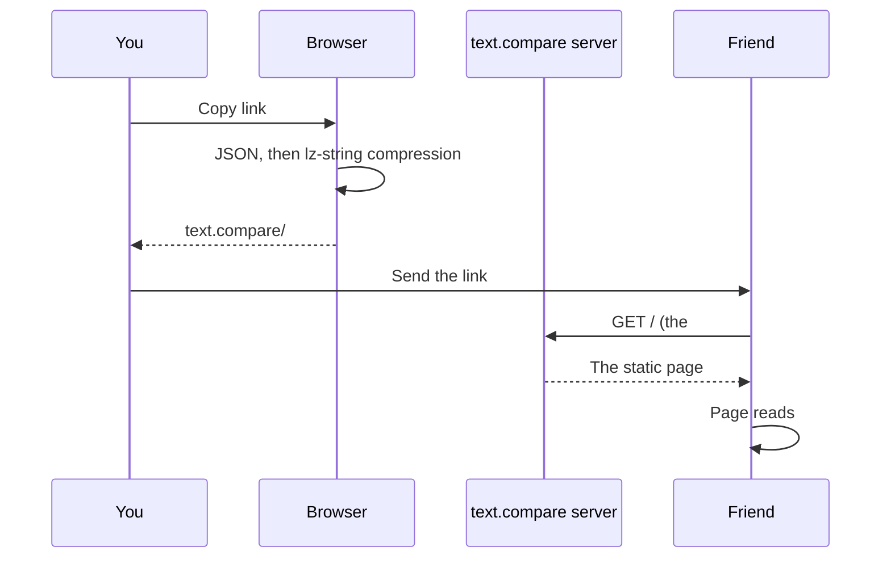

<div align="center">


# text.compare lite

**See exactly what changed.**<br />
Open-source text diff that runs in your browser: text, code, Word, Excel, PDF and images. No accounts, no uploads, no ads.

[**Try it at text.compare**](https://text.compare) &nbsp;·&nbsp;
[Host your own](#host-your-own-copy) &nbsp;·&nbsp;
[How it works](#how-it-works) &nbsp;·&nbsp;
[Support the project](#support)

[](https://github.com/JamesClayPatton/text-compare-lite/actions/workflows/ci.yml)
[](LICENSE)


[](https://buymeacoffee.com/Clayberd)

</div>

<picture>
  <source media="(prefers-color-scheme: dark)" srcset="docs/hero-dark.png" />
  
</picture>

## Why this exists

Comparing two pieces of text is a simple job, but most free diff sites wrap it in banner ads, cookie
walls and upsells, and many quietly upload whatever you paste to their servers. That's a bad deal
when the text is a contract, a config file with secrets, or your own writing.

text.compare lite is the diff tool I wanted instead: fast, clean, private by design, and good at the
hard cases like moved code, reformatted JSON, PDFs and Word documents. It's open source, so you can
check every claim below, or run your own copy in a couple of minutes.

It is the open-source core of [text.compare](https://text.compare). The hosted site adds optional
accounts on top; this version has no accounts, no server and no analytics, just the tool.

## Features

### See what changed, precisely

- **Side by side or unified**, with changed words or single characters highlighted inside each line
- **Moved blocks** are shown in violet with a tag like *Moved to line 12* that jumps to the other copy, instead of appearing as a big deletion plus a big addition
- **Syntax highlighting** for 100+ languages, picked from the file name or the text itself
- **Change map** beside the editor, <kbd>F7</kbd> / <kbd>Shift</kbd>+<kbd>F7</kbd> to step through changes, and an option to hide unchanged lines
- **Merge as you go**: both sides are editable, with undo, find and replace, and arrows that copy a block across

### Decide what counts as a change

- Ignore **upper/lower case**, **spaces at line ends**, **all whitespace** or **blank lines**
- Ignore anything matching a **pattern**: ready-made ones for dates and times, GUIDs, hex values and numbers, or your own regular expressions (made for comparing log files)

### Beyond plain text

| | |
|---|---|
| **Data view** compares JSON by structure (key order ignored, arrays of objects matched by `id`) and CSV/TSV/Excel by rows and columns, with rows matched on a key column. |  |
| **Document mode** for prose: wrapped paragraphs in a readable serif, changes shown word by word. Opens **PDF** and **Word (.docx)** files directly. |  |
| **Image compare** side by side, with a slider, as an overlay, or as a pixel-difference map that reports how much of the image changed. |  |

### Save it and come back later

- **Library** with your **saved comparisons** and a **history** of recent ones, searchable, one click to reopen
- Everything is kept in your browser, with no account needed

### Share and export

- **Copy link** puts the whole comparison inside the link itself. Nothing is stored anywhere
- **Report**: a self-contained HTML redline to send to someone, or print it straight to PDF
- **`.patch`** download in standard unified format (works with `git apply`), or copy the diff
- **Tools** to format JSON with sorted keys, sort lines, strip trailing spaces and swap sides
- Light and dark themes, a phone layout, and offline support once installed as an app

## Privacy by design

| | Where it goes |
|---|---|
| Text you paste or type | Compared in your browser tab. It never leaves the browser |
| Files you open (PDF, Word, Excel, images) | Read in your browser; never uploaded |
| Copied share links | The text rides in the part after `#`, which browsers never send to a server |
| History and saves | Kept in this browser only (IndexedDB). History can be turned off in Options |
| Analytics and tracking | None |

Nothing you compare is ever sent over the network. The included server config sets a Content
Security Policy that blocks every outside script and connection.

## How it works

text.compare lite is a static site: HTML, CSS and JavaScript. All the comparing happens in the
browser, and there is no server code at all.

```mermaid
flowchart LR
    subgraph Input
      T[Pasted text]
      F[Files: .txt .pdf .docx .xlsx]
      I[Images]
    end
    F -->|PDF.js, unzip + XML| T
    T --> N[Normalise lines<br/>case, whitespace,<br/>ignore patterns]
    N --> D["Line diff<br/>Myers O(ND)"]
    D --> W[Word / character diff<br/>inside changed lines]
    D --> M[Moved-block detection]
    W --> E[CodeMirror merge views]
    M --> E
    D -.->|background worker| S[Stats and similarity]
    T --> J[Data view<br/>JSON / CSV structure diff]
    I --> P[Pixel diff on canvas]
```



<details>
<summary><b>The diff engine</b></summary>

Lines are compared with Myers' O(ND) algorithm in its linear-space form (middle-snake bisection),
after trimming the common start and end. Each distinct line is mapped to an integer first, so the
algorithm compares numbers, not strings. A time budget makes pathological inputs fall back to a
coarser result instead of freezing the page; an 8 MB log compared against an edited copy finishes
in about two seconds.

Inside each changed block a second pass diffs *tokens*: whole words in word mode, or code points
in character mode (so emoji are never split). Those ranges become the highlighted spans.

Source: [`src/seq-diff.ts`](src/seq-diff.ts), [`src/diff-core.ts`](src/diff-core.ts), [`src/worddiff.ts`](src/worddiff.ts)
</details>

<details>
<summary><b>What counts as a change</b></summary>

Every option works by normalising a *copy* of each line before comparing: patterns are replaced
with a placeholder, then whitespace is trimmed or removed, then case is folded. Lines that match
after normalising count as equal, but the editor still shows your original text. Blank lines can be
skipped entirely, so extra spacing never shows as a change.

The same normalised diff drives the editor highlighting through a custom diff function handed to
CodeMirror, so what you see and what's counted always agree.

Source: [`src/normalize.ts`](src/normalize.ts), [`src/merge-override.ts`](src/merge-override.ts)
</details>

<details>
<summary><b>Moved blocks</b></summary>

After the diff, removed runs of lines are looked up among inserted lines. A run that reappears
elsewhere (two or more non-blank lines, or one line of 30+ characters) is a move. Moves are found
from the editor's own change blocks, so the violet highlight always lines up with the red and
green around it.

Source: [`src/moves.ts`](src/moves.ts), [`src/moved-deco.ts`](src/moved-deco.ts)
</details>

<details>
<summary><b>Data view</b></summary>

**JSON** is parsed and walked as a tree. Object keys are compared as sets, so key order never
matters. Arrays whose items all carry a unique `id`, `key`, `_id`, `uuid`, `code` or `name` are
matched by that field; other arrays are compared by position. Each difference is listed by its path,
such as `items[id=3].price`.

**CSV/TSV** is parsed with full quoting support after detecting the delimiter. Columns are matched
by header name. Rows are matched by the first column when its values are unique on both sides,
and otherwise by a diff of the rows in order.

Source: [`src/structure.ts`](src/structure.ts)
</details>

<details>
<summary><b>Files</b></summary>

- **PDF**: text is extracted page by page with [PDF.js](https://mozilla.github.io/pdf.js/), loaded only when you open a PDF
- **Word (.docx)** and **Excel (.xlsx)** are zip files of XML: they're unzipped with [fflate](https://github.com/101arrowz/fflate) and read directly, one line per paragraph or one CSV row per spreadsheet row
- **Text** is decoded as UTF-8, UTF-16 (by byte-order mark) or Windows-1252, and binary files are refused
- **Images** are drawn to a canvas and compared pixel by pixel

Source: [`src/documents.ts`](src/documents.ts), [`src/office.ts`](src/office.ts), [`src/pdf.ts`](src/pdf.ts), [`src/pixeldiff.ts`](src/pixeldiff.ts)
</details>

<details>
<summary><b>Share links</b></summary>



The text is compressed with [lz-string](https://github.com/pieroxy/lz-string) into the URL fragment.
A tiny script at the top of the page removes the fragment from the address bar before any other
script runs, so it can't leak into browser history tools.

Source: [`src/share.ts`](src/share.ts)
</details>

## Host your own copy

The build is a folder of static files, so it runs anywhere that serves files: a $5 VPS, a Raspberry
Pi, GitHub Pages, Cloudflare Pages or Netlify. It needs no database, no server code, and no
outside services.

```sh
git clone https://github.com/JamesClayPatton/text-compare-lite.git
cd text-compare-lite
npm install
npm run build          # the site is now in dist/
```

You need [Node.js](https://nodejs.org) 22.12 or newer to build (24 LTS recommended; see `.nvmrc`). Visitors only need a modern browser.

### Option 1: Docker

```sh
docker build -t text-compare .
docker run -d --restart unless-stopped -p 8080:80 --name text-compare text-compare
```

Open http://localhost:8080. The image serves the site with nginx, with long-lived caching for
hashed assets and strict security headers ([`nginx.conf`](nginx.conf)).

### Option 2: Caddy (automatic HTTPS)

```caddyfile
diff.example.com {
	root * /srv/text-compare/dist
	encode gzip zstd
	header /assets/* Cache-Control "public, max-age=31536000, immutable"
	header /sw.js Cache-Control "no-cache"
	file_server
}
```

### Option 3: Free static hosting

| Host | Build command | Output folder |
|---|---|---|
| **GitHub Pages** | Fork, then *Settings → Pages → Source: GitHub Actions*, and run the *Deploy to GitHub Pages* workflow | built for you |
| **Cloudflare Pages** | `npm run build` | `dist` |
| **Netlify** / **Vercel** | `npm run build` | `dist` |

All paths are relative, so the site also works from a sub-folder such as `example.com/diff/`.

### Configuration

`SITE_URL` sets your public address, used for canonical links, the sitemap and link previews. It
defaults to `https://text.compare`.

```sh
SITE_URL=https://diff.example.com npm run build
```

### Make it yours

- **Page titles, descriptions and the text below the tool** for the home page and each landing page (`/json-compare/`, `/pdf-compare/` and so on) live in [`site/pages.ts`](site/pages.ts). Add an entry and the build creates the page and adds it to the sitemap
- **Colours** are CSS variables at the top of [`src/styles.css`](src/styles.css), with light and dark sets
- **Icon and share image** are in [`public/`](public)
- **Search engine key**: `public/55801fe4eb037647115719a2769a5b6f.txt` is text.compare's [IndexNow](https://www.indexnow.org) key. Delete it in your copy and make your own if you want to notify Bing about your pages

### Updating

```sh
git pull && npm install && npm run build
```

Built files have content hashes in their names, so visitors get the new version on their next visit.

## Development

```sh
npm run dev            # dev server with hot reload at http://localhost:5173
npm test               # unit tests (Vitest)
npm run test:e2e       # browser tests (Playwright); run `npx playwright install chromium` once
npm run build          # typecheck, then build to dist/
```

<details>
<summary><b>Project map</b></summary>

```
src/
  main.ts              page wiring: toolbar, modes, files, export, sharing
  editor.ts            CodeMirror side-by-side and unified views
  seq-diff.ts          Myers diff on integer sequences
  diff-core.ts         line diff, stats, .patch output
  worddiff.ts          word and character highlighting
  normalize.ts         comparison options and ignore patterns
  merge-override.ts    feeds the options into CodeMirror's diff
  moves.ts             moved-block detection
  structure.ts         JSON and CSV structural comparison
  report.ts            the HTML report
  documents.ts         opening any file type
  office.ts, pdf.ts    Word, Excel and PDF text extraction
  pixeldiff.ts         image comparison
  share.ts             share-link encoding
  library/             saved comparisons and history (IndexedDB)
  analysis*.ts         stats in a background worker
  ui/                  change map, data and image panels, popovers, toasts
site/
  pages.ts             landing page content and SEO metadata
tests/                 unit tests
e2e/                   browser tests
```
</details>

The unit tests cover the diff engine, options, moves, structure diffs, reports, file readers and
share links. The browser tests drive the real page: typing, merging, share links, the library,
every landing page, and opening real PDF, Word, Excel and image files.

## Contributing

Bug reports and pull requests are welcome. Please run `npm test` and `npm run test:e2e` before
opening a pull request, and keep the privacy promise intact: nothing a user compares may leave the
browser. By contributing you agree that your contribution is licensed under the AGPL-3.0, like the
rest of the project.

## Support

text.compare lite is free and will stay that way, with no ads. If it saves you some time, you can
[buy me a coffee](https://buymeacoffee.com/Clayberd). It genuinely helps keep the site running.

## License

Copyright © 2026 James Patton ([jamesclaypatton.com](https://jamesclaypatton.com)).

text.compare lite is free software under the [GNU Affero General Public License v3.0](LICENSE). In short:

- **Use it, study it, change it and host it**, for personal or commercial use.
- **If you run a modified version as a website, publish your source code** under the same license and link to it from the site. The footer's *Get the code on GitHub* link does this for the original.
- **Keep the credit**: copies must keep the *Made by James Patton* attribution in the footer. You can add your own name next to it. See [NOTICE](NOTICE) for the exact terms.

Built with [CodeMirror 6](https://codemirror.net), [PDF.js](https://mozilla.github.io/pdf.js/),
[fflate](https://github.com/101arrowz/fflate) and [lz-string](https://github.com/pieroxy/lz-string).
